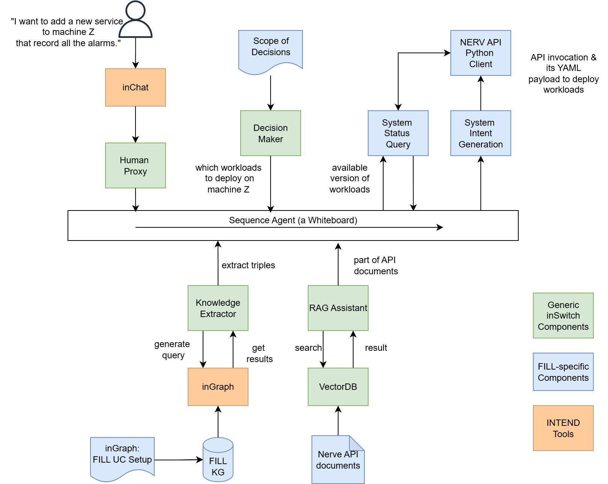
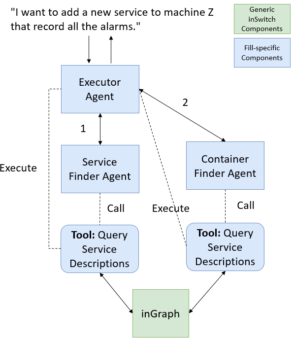
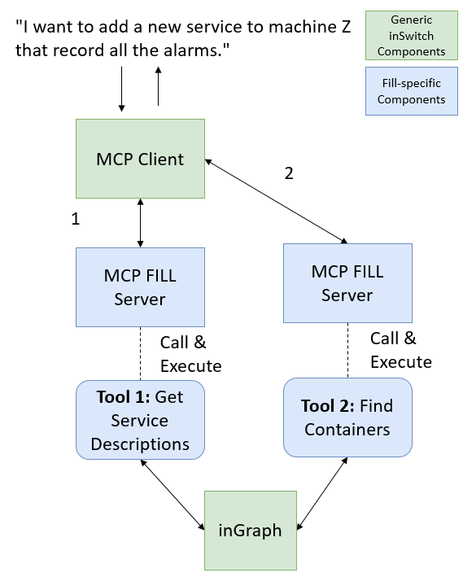

# inSwitch

## Table of Contents
- [Overview](#overview)
- [The Proof-of-Concept Scenario](#the-proof-of-concept-scenario)
- [Knowledge Extractor Sub-Module Workflows](#knowledge-extractor-sub-module-workflows)
- [APIs (TMF921 v5)](#apis-tmf921-v5)
- [Install](#install)
- [Structure](#structure)
- [Run](#run)
- [Use cases](#use-cases)
- [First taste](#first-taste)
- [Contact](#contact)
- [Acknowledgements](#acknowledgements)
---

## Overview
**inSwitch** is a tool that translates high-abstraction-level stakeholder intents into concrete technical intents for other INTEND tools, or external intent-based management tools to eventually launch the system adaptation to fulfil the original intents. 

## The Proof-of-Concept Scenario
> 

> *inSwitch Scenario: Illustrates a high-level workflow of the sample scenario using inSwitch on the [FILL](https://www.fill.co.at/en) use case.
The green boxes are the general-purpose agents that composes inSwitch, while the blue boxes are the
data, tools and documents that are specific to the FILL use case.*

---

## Knowledge Extractor Sub-Module Workflows
> 

> *Figure: Multi-Agent Knowledge Extractor Workflow for the FILL use case*

> 

> *Figure: Single-Agent Knowledge Exractor Workflow for the FILL use case*

---

## APIs (TMF921 v5)

- TMF official spec: https://www.tmforum.org/oda/open-apis/directory/intent-management-api-TMF921/v5.0

The repository for the intent management API of inSwitch can be found https://github.com/baptisterambour/intent-back  
The implementation has been externally tested on Windows. Node.js doesn't come with the environment so a Node.js feature can be added to devcontainer.json. Also we found that to create the GraphDB repository, the path for repo-config.ttl in .devcontainer/init-graphdb.sh had to be modified to "/workspaces/intent-back/.devcontainer/repo-config.ttl" to get it to run. We are currently merging the two repositories.

## Install
We recommend using [VS Code + devcontainer](https://code.visualstudio.com/docs/devcontainers/containers). You need to install the devcontainers extension to VS Code. After that, when you open this workspace in Code, there will be a pop-up window asking if you want to re-open it in devcontainer. If you missed it, use cmd+shift+p, and select 
"Dev Containers: Reopen in Container". Make sure you have a docker environment running. 

Once the workspace is reopened inside a container (to make sure it is inside a container, launch a terminal and check the user name and node name), you may need to manually install two extensions to the "new VS code", i.e., Python (ms-python.python) and Jupyter (ms-toolsai.jupyter).

You need a valid token for OpenAI API, stored in ./openai.credential. Other LLM models will be supported later. 

## Structure
- [./inswitch](inswitch/): generic components for inSwitch
- [./usecases](usecases/): data, scripts, components, etc., for different use cases

## Run
Most of the running examples and demos are in Jupyter Notebooks. To run them, you need to select a kernal - choose a python environment called "base (Python 3.12.7)". The version may vary. It is the under path "/opt/conda/bin/python".

If you face problem running python scripts, you may also try to select this same "base" python as the Python Interpreter (this can be done also via cmd+shift+p).

## Use cases
All the use cases can be found in [usecase](./usecases/). Four each use case, there is a README.md file for further information.

## First taste
So far, we have one simplified example running. You can check the snapshot [here](./usecases/fill/doc/snapshots/Step1-simplied-doc-api-call-2024-11-15.ipynb)

**Contact**
--

For support or inquiries, reach out via:
* hyunwhanjoe@snu.ac.kr

**Acknowledgements**
--

This work is part of the INTEND project (EU Horizon Europe, GA 101135576).
